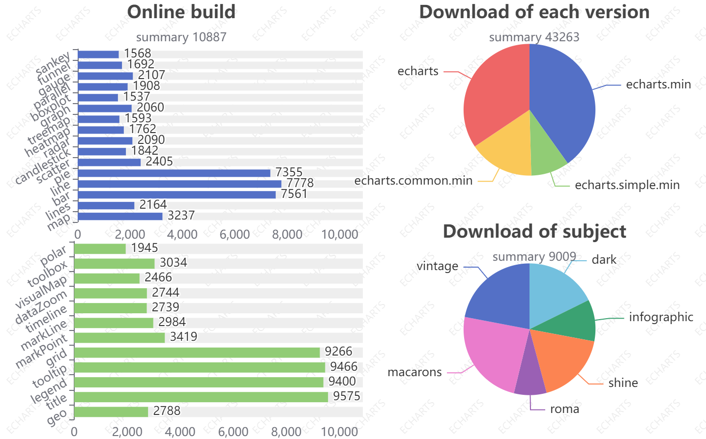
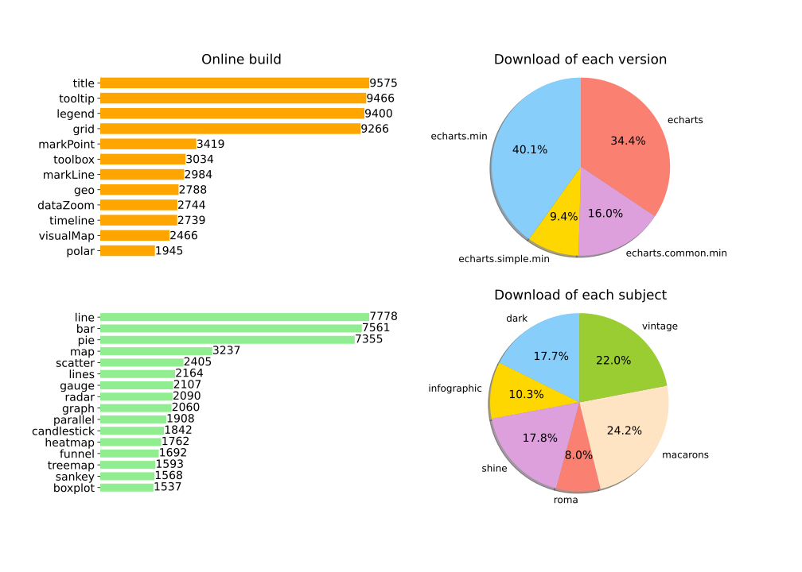

# Let the Data Speak for Themselves

## Background 
Nowadays, we are in the age of the information explosion, and the amount of data is multiplying in a very short time, which means we have access to more information than ever before and it also going to take us a lot longer to find the specific information we need. A good way to deal with this problem is use information visualization, which is a method to let the data speak for themselves. Condensing a mass of relevant data into one diagram, putting some glamour into the chart, sorting the data according to certain rules, then a beautiful information visualization occurs. Rather than letting users explore the information behind the data, data organized in this way can tell its own story.

## Apache ECharts
echarts.apache.org

This is an open-source visual chart library based on JavaScript, it can automatically generate charts in different style. Although this way is convenient, it cannot personalize the presentation of data according to specific data information, we found a chart on this website which describe a large number of users use the site's information.   

Then, let's look at one picture. It is a diagram with four small subplots. You may think it is a perfect information visualization with colorful pictures. However, there's a good chance that you don't understand what the graph is trying to deliver. This picture is got from Apache ECharts, an open-source website, which provide user with all kinds of graphic designs. Link of this diagram is as follows
https://echarts.apache.org/examples/zh/editor.html?c=watermark   
Jump to the page, we can get an insight of what the diagram expressed.       

This diagram reflects the use condition on this website in three aspect, Online Building, Download of Version and Download of Subject. It plays an important role for the users. For the developer of echarts, they have the access to know about the habit or the pattern of users so that they can make adjustments to improve it. For users, they can know about which charts, subjects and versions is the most popular in the community and then learn about it. For the technology and public, they can obtain a view of the echarts and learn something useful about information visualization. 

However, there are still some problems that stop it from being a perfect visualization. And we make some changes to improve it.

----
## Improvement

<b>
We used the percentages that come with Matplotlib, but because of the rounding of the percentages in the first graph during the calculation, the result is 99.9%
</b>    
The above diagram is the final result of our optimization. We have made improvements in the following aspects.          

+ sort the data   
+ move redundant data
+ hidden border
+ enlarge the size of words
+ change to a more harmonious color
+ put percentage data on pie charts

## Detailed Explanation of the Chart

This chart is composed of four parts, and the data can reflect the diverse needs of users on the website. The first bar chart describes the number of times different components are used on the site, In order of largest to smallest, we can clearly know "title" is used the most. 
     
The second bar chart shows the number of times different types of graphs are used, we marked both the label and the quantity. 
    
The first pie chart shows the percentage of downloads for different versions of the chart, we can find that more than 40% percent of people choose the "min.js" picture, maybe they want to save space and download time. 
    
The second pie chart shows the percentage of downloads for different subjects of charts, we put both labels and percentages on the chart, This is very convenient for people to read. 

### the Story in the Chart:  
So, what can we learn from this chart? If I am a user who needs complete assignment, I insert into the website and want to generate a chart to present in tomorrow's presentation. 
    
Titles must be the first elements I need since I don't want my audience to have no idea about what I'm talking about. If I'm not particularly skilled at using this site, I'll probably need a tooltip. Most of the time, we can directly display the data of a single group of data. For more complex data information, we'll consider using charts, so legend and grids are used a lot. As for markPoint, timeline and so on, we only use them under certain datasets. 

Line charts, bar charts and pie charts are the top three most frequent charts we used, this is exactly what we expected. Instead, radar plots are used only when analyzing multiple indicators, and scatter plots are used when dealing with scientific data, these charts are less applicable than the previous three charts.

As for downloading images, Imagine I’m preparing for tomorrow's presentation, in order to make my slides more beautiful, more advanced, I will choose "echarts.js" or "echarts.min.js" rather than "echarts.simple.js", because I've worked so hard to draw this picture, and I don't want it to be just a simple form.

At last, I need to choose a suitable subject, The choice of subject depends on personal preference and it also depends on the content of the report or presentation. If I am talking about technology, I prefer downloading "dark.js". But, if I want to show data about holidays or after-school life, I will download "shine.js", Because it looks so energetic and reminds people of happy times. 

To sum up, By looking at this graph, There are similarities and personalities in what people want from charts, People tend to use more line charts, bar charts and pie charts, and they prefer the original or "min.js" graph to the simplified one. However, there was no significant difference in the number of charts used between different subjects, because each person's personality is different, preferences are different.

### Visual variables:
There are four subgraphs in this diagram, The visual variables of the two bar charts are position and size, their data type is numerical.  The visual variables of the two pie charts are size and color, their data type is numerical.

### Cognitive theory:
1. Cognitive theory, our brain like ordered data, it can reduce the process of logical thinking in the brain, ordered data allows us to remember and understand graphs better, so we changed the order of the data to from largest to smallest.

2. In addition, human brain is sensitive to edges, which has been studied in the early days of the visual system, so we shaded the edges of the pie, compared to the original image, the improved image looks more relaxed.

3. Color is a subjective visual perception of light signals. Due to the high proportion of the population with color visual impairment, we considered the patients with color blindness when matching colors, and tried to make the visual results effectively present the information contained in them for all users. We replaced the dark color of the original image with a light color to make people more pleasant when reading this graph.
   
4. Although our brains are graphically sensitive, comparing the sizes of parts still requires a certain amount of logical thought, so we added percentages to the pie chart to save readers the process of comparing sizes, making reading easier.

## Advantages Over the Original Plot
+ Avoid rotated text   
We can see in the original picture the labels of the two bar charts are rotated. Maybe the designers want to save more space, but this made the picture a little bit difficult to read. So, we replaced rotating labels with parallel labels.
+ Minority populations need to be considered.
We considered the experience of red-green blind people and blue-green blind people. Our modified visualization using contrasting colors so that anyone can distinguish the different parts without any problem.
+ Organizing the data makes the data intuitive      
In the original bar chart, data are simply listed without order. We improve the chart by sorting the data. By arranging the data in the two bars in descending order, users can easily see which type of chart is most frequently used.
+ Label elements directly, avoiding indirect look-up.    
For the bar chart, each bar is marked with a numerical value, so it is unnecessary to show the number in the x-axis. We remove the value on the x-axis and the grid in the bar chart.
+ Add direct information on the bar chart
Mark the percentages of different types of data on the pie chart. Mark the percentages of different types of data on the picture. When the user cannot clearly distinguish the size of two approximate areas, he can distinguish them by numerical value.
+ Remove redundant data   
When we see the charts, we care about which type of chart is more often used or which subject is more popular. We don't care what the total is, showing the total frequency of usage on a graph will distract the users. So, we deleted that data.
+ Turn off the box around the figure.   
We removed the border on the bar chart.

Given the nature of discrete data, we did not change the type of the chart. There are four group of data in this multiple charts. This data is discrete data, which is suitable for bar charts and pie chart. Bar charts can display data with many data items and clearly show the comparison between data. Pie charts show the relationship between individuals and populations.

Finally, we believe our modified chart is user friendly. Charts, with harmonious colors and more rational relationship between different data items, will make users interested in this chart, furthermore, they will be more likely to explore the information that the chart intend to deliver. For all the reasons above, we believe our improved chart will convince the reader. 

----
## Conclusion

Through this assignment, our team members have a deeper understanding of information visualization, In order to help more people, share the learning results and make progress together, We shared our lessons in the community, focusing how to improve an image from a cognitive perspective, Here's our link ：https://blog.csdn.net/weixin_46476650/article/details/121707017

All in all, this picture can turn data into information, it can show the needs of different users, If a data analyst reads this picture, he can make the information this picture shows turn to his knowledge. Maybe he will know that the title feature was used the most frequently, in this case, he can put the title functionality where it's most accessible, which becomes wisdom.   
    
From the optimization of the above diagram, we can know small and proper changes will make a visualization totally different. Making data into diagrams will let the data speak for themselves. However, misuse of diagram will confuse the user or make unwanted bias. Thus, making a good information visualization, and let the data tell the story for you instead of the author.

